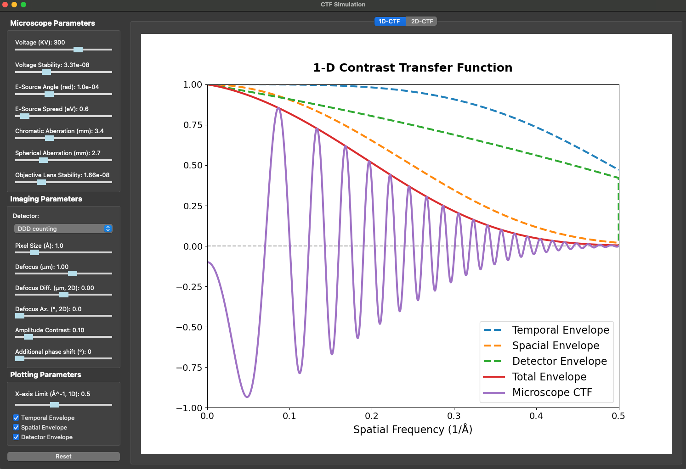

# CTF Simulation GUI
This repository provides a **Contrast Transfer Function (CTF)** implementation for electron microscopy, similar to the [ctf_notebook](https://github.com/mingleizhao/ctf_notebook) project. It features a **PyQt-based GUI** designed for speed and responsiveness, offering a more efficient alternative to the original notebook interface.

## Screenshots



## Dependencies
- **Python** 3.12
- **NumPy** 2.1.3
- **Matplotlib** 3.9.2
- **PyQt** 5.15.10

## Usage

1. **Clone the Repository**:
   ```bash
   git clone https://github.com/mingleizhao/ctf_SimGUI.git
   cd ctf_SimGUI
   ```
2. **Install Miniconda**:
   ```bash
   curl -O https://repo.anaconda.com/miniconda/Miniconda3-latest-Linux-x86_64.sh
   ```
   
   More detailed [instructions](https://docs.anaconda.com/miniconda/install/) here.

3. **Create Virutal Environment and Install Dependencies**
   ```bash
   conda env create -f environment.yml 
   conda activate CTFSimGUI
4. **Run the Application**:
   ```bash
   python main.py  
## Building a Standalone App (PyInstaller)
1. **Install PyInstaller**:
   ```bash
   pip install pyinstaller
2. **Generate the Executable**:
   ```bash
   pyinstaller --onefile --noconsole --name CTF_SimGUI main.py
3. **Run the Application**:
   ```bash
   ./dist/CTF_SimGUI
## Feedback
- For questions, comments, or bug reports, please email mlzhao@uchicago.edu.
