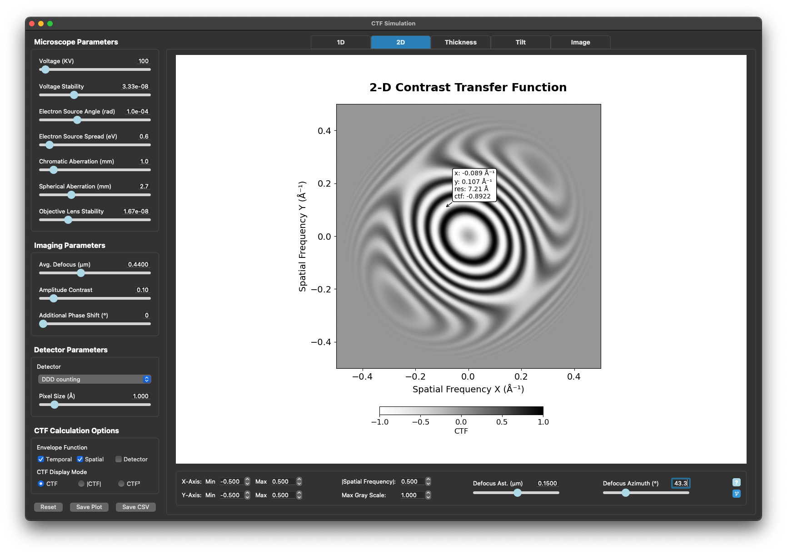
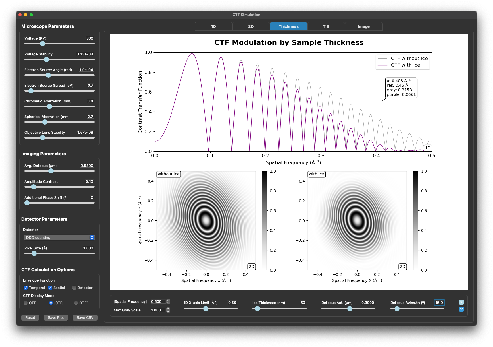
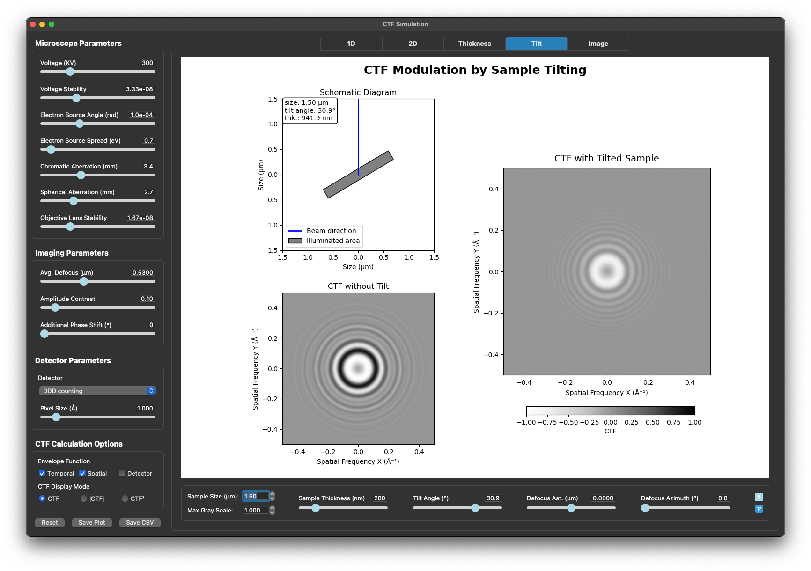

# CTF Simulation GUI
This repository provides a **Contrast Transfer Function (CTF)** simulation tool for electron microscopy, similar to the [ctf_notebook](https://github.com/mingleizhao/ctf_notebook) project. It features a fast and responsive **PyQt-based GUI**, offering a streamlined and interactive alternative to the original notebook interface.

## Features

The GUI consists of five interactive tabs, each focusing on a key aspect of CTF behavior:

1. **1D CTF**  
   Visualize and explore the 1D CTF curve, including effects of defocus, spherical aberration, phase shift, and envelope functions. Useful for understanding how CTF oscillates and attenuates in frequency space.

2. **2D CTF**  
   Examine the 2D structure of the CTF in reciprocal space, with support for astigmatism and various envelope functions. Ideal for visualizing symmetry, periodicity, and astigmatism behavior.

3. **CTF Modulation by Sample Thickness**  
   Demonstrates how a range of defocus values — representing variable sample thickness — affects the resulting CTF through integration. Reveals how defocus spread smooths out oscillations and dampens high-frequency information.

4. **CTF Modulation by Sample Tilting**  
   Simulates the apparent CTF changes when tilting a sample, as in electron tomography. Illustrates how projection geometry influences defocus, envelope functions, and CTF modulation across tilt angles.

5. **Image Modulation by CTF**  
   Allows users to visualize how the CTF modulates real or synthetic images in both real space and frequency space (FFT). Includes convolution with the CTF and support for user-uploaded images. Highlights signal loss and modulation across spatial frequencies.

## Additional Highlights

- Real-time sliders for microscope and imaging parameters.
- Visualization of envelope functions: temporal, spatial coherence, and detector response (DQE).
- FFT-based convolution to demonstrate how CTF alters image appearance.
- Support for user image upload, cropping/resizing, and visualization.
- Export options for plots and data (CSV, PNG).

## Screenshots




## Dependencies
- **Python** 3.12
- **NumPy** 2.1.3
- **Matplotlib** 3.9.2
- **PyQt** 5.15.10
- **Pandas** 2.2.3
- **Pillow** 11.1.0

## Usage

1. **Clone the Repository**:
   ```bash
   git clone https://github.com/mingleizhao/ctf_SimGUI.git
   cd ctf_SimGUI
   ```
2. **Install Miniconda**:
   ```bash
   curl -O https://repo.anaconda.com/miniconda/Miniconda3-latest-Linux-x86_64.sh
   ```
   
   More detailed [instructions](https://docs.anaconda.com/miniconda/install/) here.

3. **Create Virutal Environment and Install Dependencies**
   ```bash
   conda env create -f environment.yml 
   conda activate CTFSimGUI
4. **Run the Application**:
   ```bash
   python main.py  
## Building a Standalone App (PyInstaller)
1. **Install PyInstaller**:
   ```bash
   pip install pyinstaller
2. **Generate the Executable**:
   ```bash
   pyinstaller --onefile --noconsole --name CTF_SimGUI main.py
3. **Run the Application**:
   ```bash
   ./dist/CTF_SimGUI
## Feedback
- For questions, comments, or bug reports, please email mlzhao@uchicago.edu.
